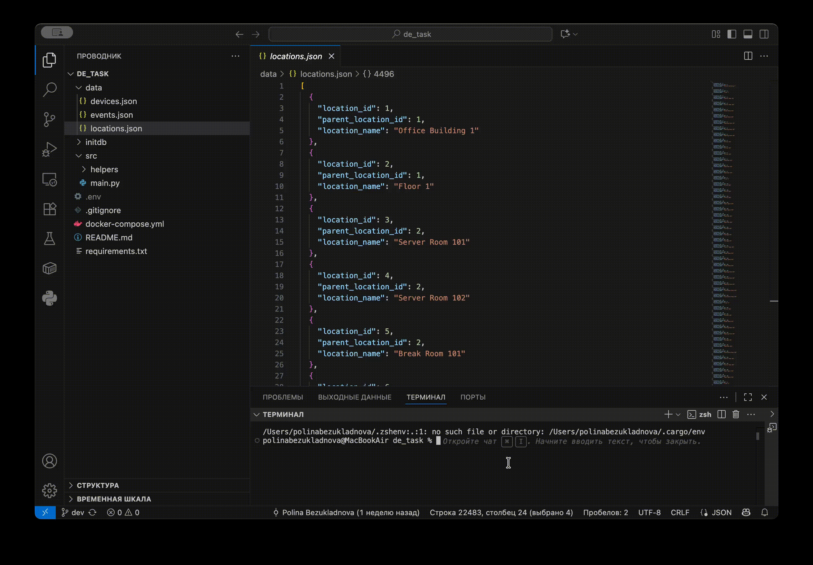

# IoT Data Pipeline with PostgreSQL and Docker

The project is a fully functional ETL system for processing Internet of Things (IoT) data. The system loads data from JSON files, transforms them into a relational PostgreSQL structure, and performs complex analytical queries with the ability to export the results.




## Tech Stack
**Core Technologies**
- Python 3.13
- PostgreSQL 15
- Docker & Docker Compose

**Data Processing & Database**
- psycopg2-binary 2.9.11
- JSON
- JSONB
- XML 

**Infrastructure & Utilities**
- python-dotenv 1.2.1
- argparse
- logging
- os


## Installation

**1. Clone repository**
```bash
git clone git@github.com:p0mona/de_task.git
cd de_task
```

**2. Start infrastructure**
```bash
docker-compose up -d
```

**3. Set up Python environment**
python3 -m venv venv
```bash
source venv/bin/activate  # Linux/Mac

venv\Scripts\activate  # Windows
```

**4. Install dependencies**
```bash
pip install -r requirements.txt
```

**5. Run the application**
```bash
python3 src/main.py \
    --locations data/locations.json \
    --devices data/devices.json \
    --events data/events.json \
    --format json
```


## License

[MIT](https://choosealicense.com/licenses/mit/)

